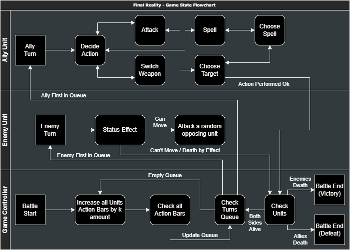

# Final Reality

>Final Reality is a simplified clone of the renowned game, Final Fantasy. Its main purpose is to
serve as an educational tool, teaching foundational programming concepts.

*This README is yours to complete it. Take this opportunity to describe your contributions, the
design decisions you've made, and any other information you deem necessary.*

## 1° Assigment
### Partial Assigment 1
- Made sure to not use words "Unit", "Class", "def" for naming, to avoid problems with existing 
fields, instead used "Units", "Profession", and "defense".
- Packages/folders for Weapons, Professions, and Units which correspond to Characters and Enemies.
- Units trait for common stats between enemies and player characters.
- ICharacter trait adds profession field and Enemy trait adds damage.
- Abstract class for empty held weapon and isAlive method, common in all characters.
- Party class, with default dummy characters, can ask members if they are alive to determine if whole party 
is alive, and can add members up to three.
- Profession trait with name implemented by each profession extending from abstract class 
constructor, which will be easier to compare later.
- Weapon trait for common attributes, and two abstract classes for common and magic weapons with magic damage.
- Tests with munit.FunSuite, mainly of constructors, making sure to have good coverage.
### Partial Assigment 2
- Programmer class in charge to manage actionbar changes and determining which enemy or character can get a turn
- Programmer can add and remove units (max 3 party members, max 5 enemies per battle)
- Programmer for now has an arbitrary amount k to increase the actionbar each step
- They ideal combat manager will step the programmer, then ask if any member can perform a turn, and if true,
perform an action with returned unit, otherwise keep stepping to increase actionbars
- Maybe one programmer object can be used for each different battle, making sure to destroy the leftover object
### Final Assigment 1
- Started the privatization of values and methods, making sure that var type values where at least protected, while
val types can be public. And added methods to view some now private or protected values.
- Decided to add a maxLife value for units, it could be useful in the future for not healing over the maximum.
- Used require to avoid using illegal values in constructors.
- Added methods for character attacking enemies, enemies attacking characters, character taking damage by enemies, 
and enemies taking damage by characters.
- Added more tests for more code coverage.

## 2° Assigment
### Partial Assigment 3
- Added two exceptions for invalid weapon for profession and weapon already being used by someone else.
- Added methods to characters and weapons using double dispatch to ask the weapon itself for equipping and even
throwing exceptions if required. The idea for the future is to check if weapons can be equipped, then equip
the weapon later, but if trying to force equip something that should not be equipped, exceptions get thrown 
for equipping something null, for weapons already being used by someone else, and by invalid weapons for a
certain profession.
- Added methods for un-equipping weapons and made sure to update the max action bar after equipping and
un-equipping weapons.
- Also added method to weapons to get the owner for comparing.
### Partial Assigment 4
- I already had implemented un-equipping weapons, max of 3 party members, and enemies can only attack players,
and players can only attack enemies. But still added a bit of more code to make it look better and even added 
more tests.
### Final Assigment 2
- Added a MagicWeapon trait between Weapon and AbstractMagicWeapon, for type checking if owner has wand or staff,
but ended up not using it. (maybe useful in the future)
- Added a MagicAlly, Effect, DarkSpell, and LightSpell traits for type checking.
- MagicCharacter now has 3 methods for casting a spells, with each checking most conditions for a valid cast;
this was done because of the nature of the spells. (dark spells only target enemies, offensive light spells
target enemies, and the only light spell that targets allies is heal)
- Each spell is their own class, where they each has their method which checks mana conditions and calls
methods for hurting enemies, inflicting a status effect, and healing (even if its in general units, because
MagicCharacter method Only allows healing an ally, the called method in Heal only can get an ally)
- The effect trait and package is made only for the future where the method in enemies to apply the status is
fully implemented.
- In another note, this was probably the hardest requirements to implement (not long, just tough)

## 3° Assigment
### Partial Assigment 5
- Ideal Game State Flowchart: 
- Started adding the controllers and game states (many new files because of the amount of states).
- Many lines of "new" code had to be removed because it would not work, until i found the current tentative 
and hopefully functional approach.

This project is licensed under the
[Creative Commons Attribution 4.0 International License](https://creativecommons.org/licenses/by/4.0/).